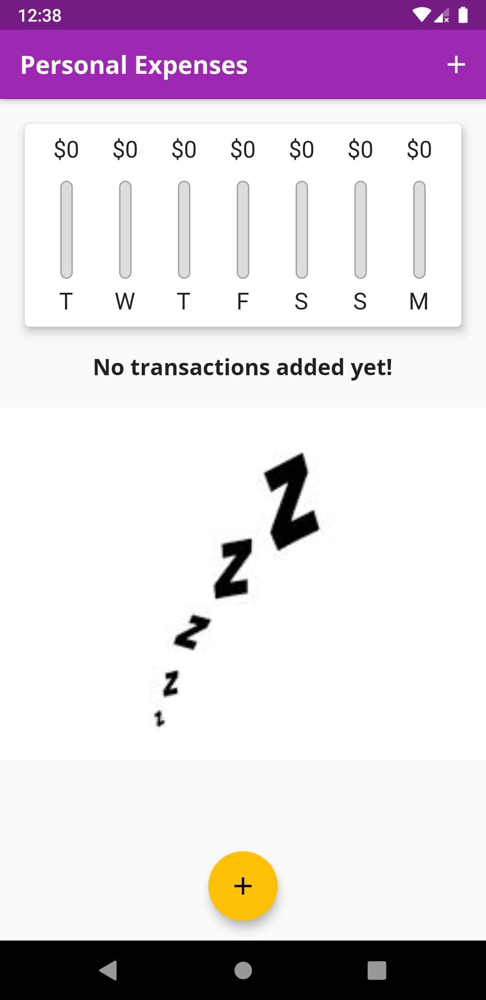

# Expenses App

A simple flutter application on daily wage of expenses.

 
  
  
  

## Getting Started
This is the when you open the app(also after closing it and reopening it)

Let's go through the app. The app has :
- Chart showing the graphical preview of the expenses last week.
- The picture where it is showing 'No transactions added yet!', will be converted to a list shown later.
- A Floating Action Button or the button up in the app bar will open a modal bottom sheet which help us to add a transaction.

 ## Pressing '+' icon
 It opens an bottom sheet which has the following components :

- Title will contain the name of item
- Amount the price in dollars
- Choose Date is the flat button and pressing on it will pop up a date picker. On picking date, the choosed date will be seen instead of 'No date choosen'.
- Add transaction will add the item to the list.

## Final View
The final view is as follows:
- The chart shows the relative expenditure done in the last week with respect to day.
- The list item shows the price in the circle, title and date. On pressing the delete icon that item will be deleted.
- The list item is scrollable, so we add as many items as we want!

## Future Improvements
- The items are not stored permanently. On closing and reopening the app, All the data is lost.
- More interactive bottom sheet. 
